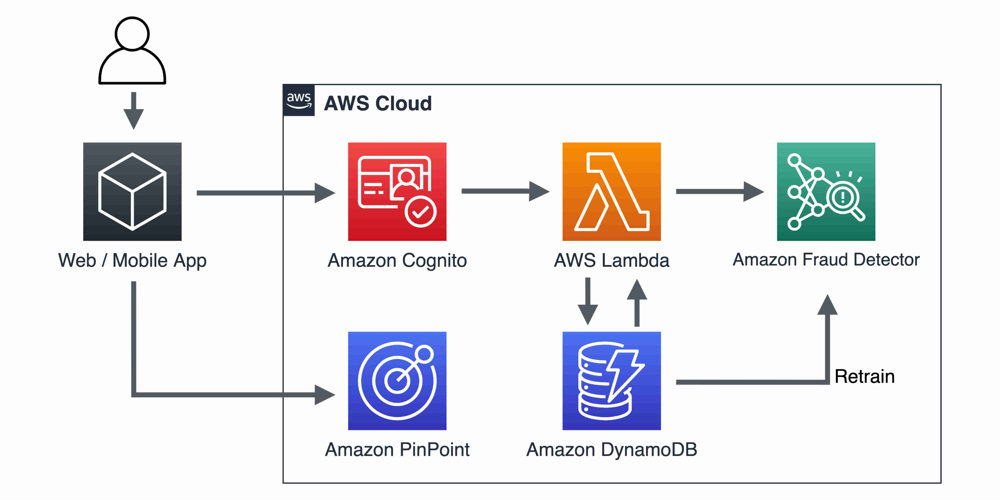

# Fraud Prevention with Amazon Fraud Detector and Amazon Cognito

This application demostrates how to implement Amazon Fraud Detector along with Amazon Cognito User Pools with customized auth flows and utilizing Cognito Lambda triggers to implement friction in the registration process for users whose fraud risk score is `medium`. 

For fraud risk scores `low`, users will be registered and confirmed automatically to the Cognito User Pool. For fraud risk score `high` the `PreSignUp` Lambda trigger will prevent the user from sign up.

This project contains AWS Cloud Development Kit (CDK) application that deploys all the AWS resources necessary to implement a real-time fraud detection system using Amazon Cognito's custom auth workflow.

<p align="center">
  
</p>

## Getting Started
### Pre-requisites

- An [AWS Account](https://console.aws.amazon.com/console/home).
- [Install `node` and Node Package Manager (`npm`)](https://docs.npmjs.com/downloading-and-installing-node-js-and-npm)
- [Download and install AWS CDK CLI](https://docs.aws.amazon.com/cdk/latest/guide/getting_started.html#getting_started_install) in your local machine.
- Access to an AWS account with administrator or PowerUser (or equivalent) AWS Identity and Access Management (IAM) role policies attached with permissions for Amazon Fraud Detector, Cognito, Lambda, Amazon DynamoDB, Amazon API Gateway, and Amazon Pinpoint.
- [Build an Amazon Fraud Detector Model](https://docs.aws.amazon.com/frauddetector/latest/ug/part-a.html)
- [Create a detector to generate real-time fraud predictions ](https://docs.aws.amazon.com/frauddetector/latest/ug/part-b.html)

### Installation

1. Clone this repository and change directory

```bash
git clone <repo_url> afd-cognito-demo
cd afd-cognito-demo
```

2. Install the required CDK Modules 

```bash
npm install --save
```

3. Update the `.env` file with the necessary information. You will need to provide the AWS account number and region you wish to deploy this application to. You will also need information about Amazon Fraud Detector' detector name, version, event type name and entity type names that you created as part of the pre-requisites. For example

```bash
AWS_ACCOUNT_NUMBER=111122223333
AWS_REGION=us-east-1
AFD_DETECTOR_NAME=sample_detector
AFD_DETECTOR_VERSION=1
AFD_EVENT_TYPE=sample_registration
AFD_ENTITY_TYPE=sample_customer
```

4. Confiure IAM policies in the `config/policies.json` file. This CDK project creates Lambda functions. In order for the Lambda functions to be able to access other AWS resources, such as Amazon Fraud Detector, Cognito User Pool, and DynamoDB table, it needs an IAM Role with the required permissions. You should add policy names in the `policies.json` file so that the CDK project can create the IAM Role with the policies.

```json
{
    "policy_names":[
        "policy-name-1",
        "policy-name-2",
        "policy-name-2"
    ]
}
```

For the purposes of this project the following AWS Managed policies are sufficient.

```bash
service-role/AWSLambdaVPCAccessExecutionRole
AmazonCognitoPowerUser
AmazonDynamoDBFullAccess
AmazonFraudDetectorFullAccessPolicy
```

> :warning: Some of the policies specified above can be more permissive than desired. Please exercise caution and follow [principles of least privileges](https://aws.amazon.com/blogs/security/techniques-for-writing-least-privilege-iam-policies/) while creating IAM Roles for your AWS resources. 

5. [Bootstrap](https://docs.aws.amazon.com/cdk/latest/guide/bootstrapping.html#bootstrapping-howto) the CDK project by replacing the `<account_number>` and `<region>` with your AWS account number and region where you wish to deploy the project.

```bash
cdk bootstrap aws://<account_number>/<region>
```

6. [Synthesize an AWS Cloudfromation template](https://docs.aws.amazon.com/cdk/latest/guide/hello_world.html#hello_world_tutorial_synth) from the CDK project

```bash
cdk synth --all
```

7. Deploy the CDK Project

```bash
cdk deploy --all
```

8. (Optional) If you have already deployed this CDK app but have made new changes, you can run the command below to see the changes

```bash
cdk diff
```

### Cleaning up

To avoid incurring future charges, delete the resources created for the solution.  

```bash
cdk destroy --all
```
## Security

See [CONTRIBUTING](CONTRIBUTING.md#security-issue-notifications) for more information.

## License

This library is licensed under the MIT-0 License. See the LICENSE file.
